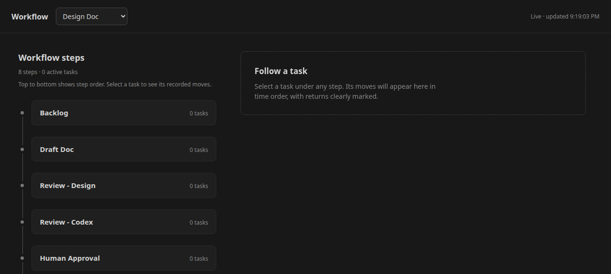
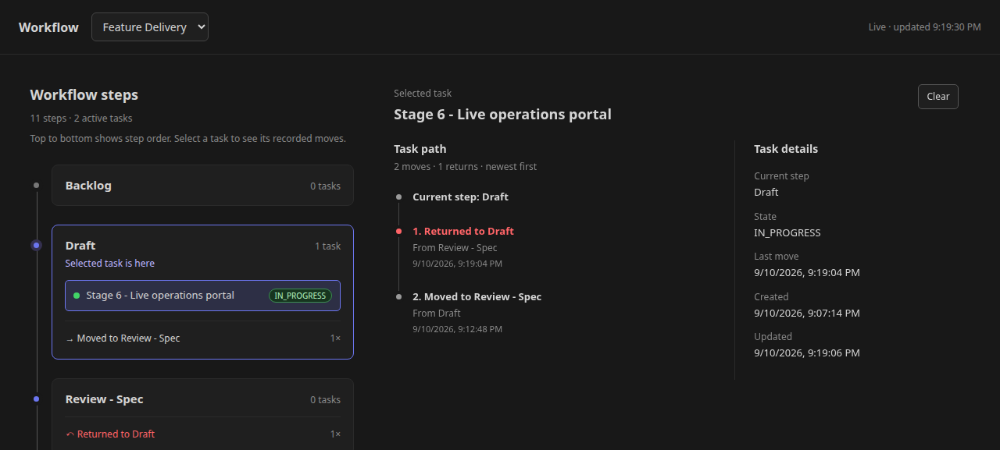
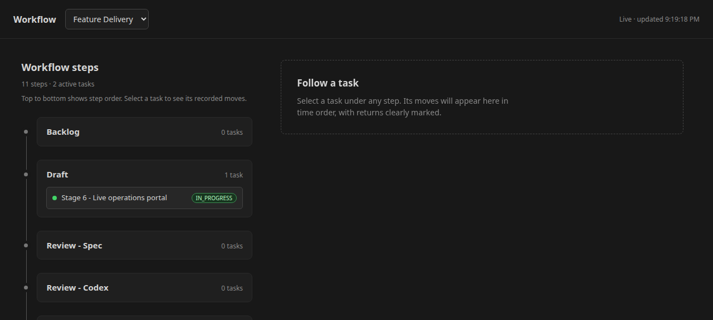

# Live Workflow Diagram — how it works, and how to run it

A read-only, single-file visualization of how tasks actually move through a
Kandev workflow: which steps a task passed through, which steps it got
bounced back from, and how often — the thing you'd otherwise have to
reconstruct by hand-querying `task_step_transitions`.

Built and iterated inside this repo as an internal tool (see
`docs/specs/live-workflow-diagram.md` for the original design/decision
history). This guide documents the finished tool for anyone outside that
history — what it does, how it's built, and how to run it — as the
reference material for `docs/kandev-upstream-contribution-notes.md`'s
proposal to contribute it to `kdlbs/kandev`.

## What it shows



A workflow picker (top) and its steps in order (left), each showing its
active task count. Select any task under a step to see its recorded path:



- **Task path** — every move that task has made, newest first, with the
  current step pinned at the top. A move back to an earlier step ("Returned
  to Draft") is labeled and colored red, distinct from forward progress —
  the exact pattern that's easy to lose track of by reading chat logs one
  task at a time.
- **Task details** — current step, state, and the created/updated
  timestamps, alongside the path so you don't need a second query to get
  context on what you're looking at.
- **Live updates** — the page polls for changes and refreshes in place; no
  manual reload needed to watch a task move in real time.



## How it works

One Python file, standard library only — no dependencies, no build step,
no external assets or JS/CSS libraries loaded. `http.server`'s
`BaseHTTPRequestHandler` serves everything: the page itself (native
HTML/CSS, vanilla JS for the polling refresh) and a small JSON endpoint the
page's own JS polls on an interval.

Data comes from a **read-only** SQLite connection
(`sqlite3.connect(..., uri=True)` opened `?mode=ro`) directly against
Kandev's own database file (`~/.kandev/data/kandev.db` by default) — the
tool never writes to it, and never talks to Kandev's backend process or its
MCP/API surface at all. It reads three tables:

- `workflows` / `workflow_steps` — the step list and order for the
  selected workflow.
- `tasks` — title, current step, state, and timestamps for every task in
  that workflow.
- `task_step_transitions` — the actual recorded history of moves: which
  step a task went from, which step it landed on, and when. This is the
  table that makes "how often does this step get returned to" answerable
  at all — it's the ground truth the diagram renders, not an inference.

On each poll, the server re-reads current state and diffs it against what
it last sent; if an active task's current step changed since the last poll,
the page plays a short, soft sine-wave audio ping (Web Audio API,
`oscillator.type = 'sine'`) so a change is noticeable without staring at
the screen — silent on first load, and unlocked by the first user
interaction so browser autoplay policy is respected.

The page follows Kandev's own `localStorage.theme` preference (`light` /
`dark` / `system`) and `prefers-color-scheme`, so it looks native sitting
next to the Kandev UI rather than like a foreign tool.

## Running it

Zero setup beyond a Python 3 interpreter — no `pip install`, no config file
required for the common case (it auto-detects the default Kandev database
path).

```bash
python3 workflow-diagram.py
# open http://localhost:8420/
```

Optional flags, all with sensible defaults:

```bash
python3 workflow-diagram.py --port 8420 --poll-interval 3 --db ~/.kandev/data/kandev.db
```

### Running it persistently (optional)

For a `systemd`-managed Linux setup — the same pattern Kandev's own
[`docs/public/run-as-a-service.md`](https://github.com/kdlbs/kandev/blob/main/docs/public/run-as-a-service.md)
documents for Kandev itself — a user service keeps the diagram up
alongside Kandev without a manual step every time:

```ini
# ~/.config/systemd/user/kandev-workflow-diagram.service
[Unit]
Description=Kandev live workflow diagram
After=kandev.service
Wants=kandev.service

[Service]
Type=simple
WorkingDirectory=/path/to/this/repo
ExecStart=/usr/bin/python3 /path/to/this/repo/ops/workflow-diagram.py --port 8420
Restart=on-failure
RestartSec=5s

[Install]
WantedBy=default.target
```

```bash
systemctl --user daemon-reload
systemctl --user enable --now kandev-workflow-diagram.service
```

It comes up automatically after `kandev.service` (or on login, if Kandev
itself isn't running as a service) and restarts on failure — no need to
remember to launch it each time a task starts.

## What it deliberately doesn't do

- No write access, ever — a bug in this tool cannot corrupt Kandev's state.
- No dependency on Kandev's backend being reachable over HTTP/MCP — it
  works even if the backend process is unresponsive, since it reads the
  database file directly (useful precisely when you're debugging a stuck
  task and the backend might be part of the problem).
- No external services, fonts, or CDN assets — works fully offline once
  the page has loaded once, and needs no allowlisting in a locked-down
  environment.
