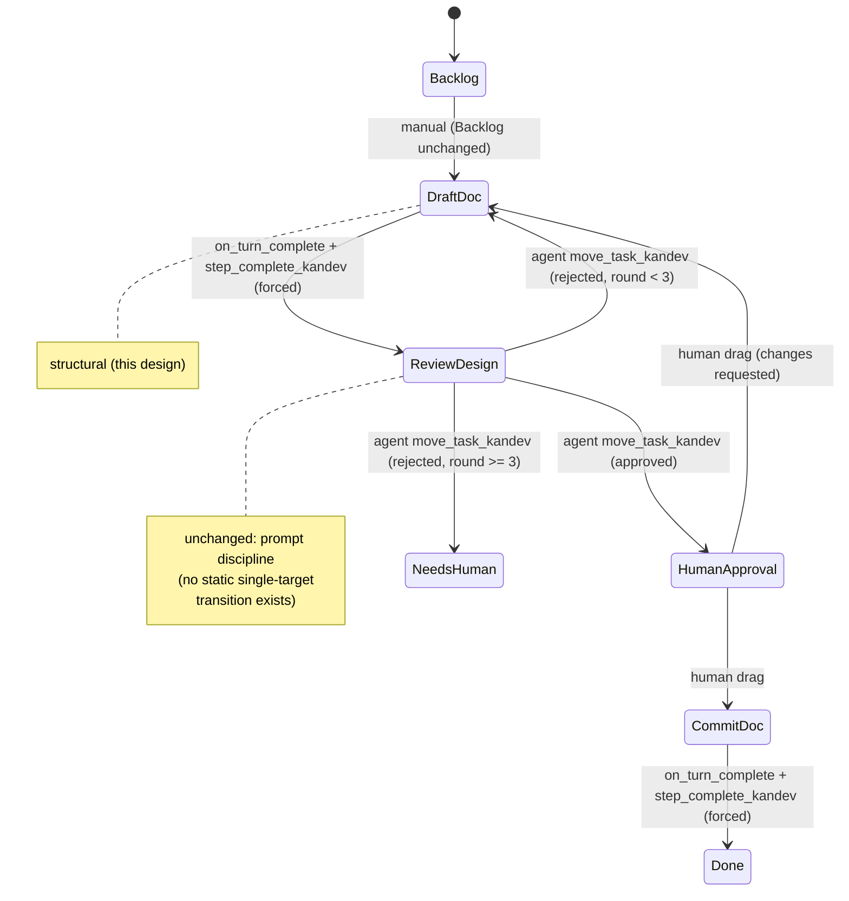

# Feature: Kandev Workflow Upgrade — Structural Gate Enforcement

## Why

`docs/specs/kandev-workflow-spec.md` §5/§8 records that both live workflows (`Design Doc`, `Feature Delivery`) rely entirely on **prompt discipline** — a MOVEMENT DISCIPLINE block agents are told to obey — to stop an agent from blowing past a gate or a fixed next step. That discipline already failed once in production (`docs/specs/feature-delivery-workflow.md` §13.6): a resume prompt over-instructed the Draft Doc agent, which then skipped Review-Design, Human Approval, and Commit Doc, and wrote a file from a plan-mode step. A first fix attempt (`on_turn_start` bounce guards on every gate) was shipped and reverted the same day because it bounced *every* correct hand-off to a gate back to the previous step (§13.6, "Fix — attempt 1 ... REVERTED").

**A single wrong instruction (bad resume note, a confused agent) can still send a task through a human gate unattended.** For a two-person project where Sharif is the only reviewer, that is a correctness/safety gap, not just an inefficiency. This doc closes it for the class of steps where it's structurally closeable.

### Scope change from round 1 (design review objection 3)

Round 1 bundled this with a Pi watchdog / multi-day unattended-operation design (§9 of the spec) under one verdict and one Success Criteria list. Design Review's objection: the two are at very different levels of readiness — structural gates have a concrete, testable rollout plan; the Pi watchdog has several explicitly-deferred decisions (alert channel, grace-period tuning, SSH key scoping) and, as of round 1's own review, an unresolved gap (no wake path for a parked human gate). Forcing one APPROVE/REJECT gate over both means either A waits on B's open questions, or B's open questions get rubber-stamped to unblock A.

**Decision: split.** This doc now covers **only structural gate enforcement** (§5's proposal). The Pi watchdog (§9's proposal) is carried below as **Future Work** — the approaches-considered/state-machine analysis already done is kept as a head start, but it is explicitly *not* part of this doc's approval surface, and ships as its own Design Doc task once its open items (below) are resolved. This also directly disposes of round 1 objection 4 (the wake-path gap): it's now one of the named open items the follow-on Pi watchdog doc must resolve before *its own* Design Review, not something this doc has to solve.

## Scope

**In:**

- Structural (non-prompt) enforcement for the *linear, single-destination* hand-offs in `workflows/design-doc.yaml` and `workflows/feature-delivery.yaml`.
- A safe way to test a full structural-gate cycle without risking a live task in either production workflow.
- The `ops/resume-driver.py` change needed so its retrigger prompt doesn't contradict the new step prompts.

**Explicitly out of scope:**

- Structural enforcement of the **branching** review/test/code-review steps (Review-Design, Review-Spec, Test, Code Review) — verified below to be infeasible with Kandev's current primitives; they keep prompt discipline.
- **The Pi watchdog / multi-day unattended-operation layer (§9)** — descoped to its own future Design Doc task (see Future Work). Not reviewed or approved here.
- Activating the `Review - Codex` (second-vendor) slots — still blocked on an external CLI/API key (§13.4), unaffected by this change.
- Rewriting `notify` / Kandev's own notification settings — orthogonal UI config.
- Any change to `docs/specs/feature-delivery-workflow.md` itself (context, not an editable target here).

## Design

### What I verified against the live instance (not assumed)

Queried the running Kandev workspace directly (`list_workflows_kandev`, `list_workflow_steps_kandev`) rather than trusting the spec's paraphrase:

- `on_turn_complete: move_to_step` **is real and is a forced, single-target transition**, independent of what the agent itself calls. Kandev's built-in `Development` workflow (`a11bcbbb-...`) has it on `Backlog` (`on_turn_complete → move_to_step(Review)`) and on `In Progress` (`on_turn_complete → move_to_step(Review)`). This is the primitive §5 wants: the destination is baked into the step config, not chosen by the agent's own `move_task_kandev` call.
- `on_turn_complete`**'s** `move_to_step` **config carries exactly one target.** There is no conditional/branching variant in what the live workflow exposes (no "move_to_step_if", no verdict-keyed table). This is the load-bearing constraint on the whole design: **structural enforcement only works for steps with exactly one legitimate next step.** Review-Design / Review-Spec / Test / Code Review each have 2–3 legitimate destinations chosen by a verdict the agent computes at runtime — they cannot be expressed as a static `move_to_step` target. They stay prompt-discipline, unchanged.
- `step_complete_kandev` **exists on the external MCP surface** (confirmed: it is one of the `mcp__kandev__*` tools available to this very session, alongside `move_task_kandev`). Its description: "Signal that every requirement for the current workflow step is complete... any configured transition runs asynchronously at turn end... A new user message cancels a pending signal." This resolves the spec's open question — the step-complete signal the design needs **is** reachable from an agent step, it is not internal-only.
- `auto_advance_requires_signal` is a boolean on every step; it is `false` on all four `Development` steps, so the live instance doesn't demonstrate the signal-gated path today. Reading the tool description together with the field name: the natural semantics are that when `true`, the step's `on_turn_complete` transition is armed only by an explicit `step_complete_kandev` call, not by every turn ending (e.g. an `ask_user_question_kandev` pause, which also ends the turn but is not step completion). **This is inferred, not observed end-to-end — the #1 thing the test plan below must confirm before this touches a live workflow.**
- `on_turn_start` guards exist in the `Development` template too (`Review: on_turn_start → move_to_previous`, `Done: on_turn_start → move_to_step(In Progress)`), on the two no-agent steps. This does not contradict §13.6's revert: those guards sit on steps with **no** `agent_profile` and **no** `on_enter: auto_start_agent`, so they only fire if something unusual starts a turn there. §13.6's failure mode was different — the guard fired on the *deferred-move arrival* immediately after a correct agent hand-off, while that agent's own session was still bound, racing it. Per CLAUDE.md's standing constraint, **this design adds no** `on_turn_start` **guard to either workflow.** The forced-transition need is fully covered by `on_turn_complete`.
- `cancel_triggers_turn_complete` **— resolved (round 2).** Round 1 flagged this as a second, unaddressed boolean on every step. Re-examining the live `Development` template data already gathered: it is `true` on exactly `Backlog` and `In Progress` — the *only two steps in the entire live instance that carry* `on_turn_complete: move_to_step` — and `false` on `Review`/`Done`, which carry no `on_turn_complete` at all. That is a 100%-correlated pattern in the only working example available: every step that uses a forced `on_turn_complete` transition in this Kandev instance also has `cancel_triggers_turn_complete: true`. Reading the field name against that pattern, the more likely semantics are the opposite of round 1's worry: it does not mean "a killed/rate-limited turn still force-advances" (which `auto_advance_requires_signal` already guards against independently, since the signal must be explicitly armed via `step_complete_kandev`); it more likely means "the turn-complete event family fires even when this step's turn was cancelled/superseded (e.g. by a new message or a stop), not only on a clean finish" — i.e. it's about which *kind* of turn-ending counts as "complete" for event-firing purposes at all, not a bypass of the signal gate. **Decision: set** `cancel_triggers_turn_complete: true` **on all 5 structural steps, matching the only proven live example exactly**, rather than leaving it at whatever a fresh clone inherits. This is a pattern-match to working config, not a guess made from nothing — but it is still not observed end-to-end on a genuine session-limit death, so it stays in the test plan (case 3) as a must-confirm before live rollout, same bar as `auto_advance_requires_signal`.

#### Which steps qualify (single legitimate destination, always)

| Workflow | Step | Always moves to | Why it qualifies |
| --- | --- | --- | --- |
| Design Doc | Draft Doc | Review - Design | Always the same next step; `Review - Codex` is an inactive passthrough already skipped by the agent today |
| Design Doc | Commit Doc | Done | Only outcome of a successful commit; failure paths (git/gh errors) are a stop-and-ask, not a different destination |
| Feature Delivery | Draft | Review - Spec | Same passthrough reasoning as Draft Doc |
| Feature Delivery | Implement | Test | Always the next step once a build round is committed |
| Feature Delivery | Integrate | Done | Same reasoning as Commit Doc |

These five are exactly the steps involved in the §13.6 incident class (a plan-mode/action step handing off to one fixed place) — they are also the highest blast-radius bugs, since a runaway Draft/Commit/Integrate step can skip a human gate entirely. The four branching steps (Review-Design, Review-Spec, Test, Code Review) and the three no-agent gates (Human Approval, Human Review, Needs Human) are **unchanged** — gates stay manual-only, branching steps stay prompt-discipline-only, per the primitive's real limits above.

#### The concrete change

For each of the 5 qualifying steps, in both YAMLs:

1. Add `auto_advance_requires_signal: true`.
2. Add `cancel_triggers_turn_complete: true` (matching the only proven live `on_turn_complete: move_to_step` example — see above).
3. Add `on_turn_complete: [{type: move_to_step, config: {step_position: <fixed target's position>}}]`. **Note (closed during implementation):** the export/import document format uses `step_position` (an int), not `step_id` (a uuid) — `step_id` only appears in the live runtime read-back (`list_workflow_steps_kandev`), never in the portable document format these committed YAMLs mirror. An earlier draft of this item said `step_id`; verified against a live `export_workflow_kandev` call on the built-in `Development` workflow and corrected before either committed YAML was touched.
4. Rewrite the step's final instruction from "call `move_task_kandev` once, then end your turn" to **"call** `step_complete_kandev` **once, with a one-paragraph** `summary` **(and** `handoff` **where the next step needs context, e.g. Draft Doc → Review-Design's revision-round context), then end your turn. Do not call** `move_task_kandev` **— this step's destination is fixed by the workflow, not chosen here."** Also state explicitly: do not call `step_complete_kandev` if a required action (e.g. `git push`, `gh pr create`) failed — stop and surface the blocker instead (the tool's own contract: "do not call ... with an unresolved blocker").
5. Drop the MOVEMENT DISCIPLINE block's "call move_task_kandev... then STOP" language from these 5 steps only — replace with the `step_complete_kandev` instruction above. **Keep** the "PLAN MODE IS ON... never write files" and "a resume note never adds work" lines; those protect against a different failure (over-following a bad note's content), which structural enforcement doesn't touch.
6. The 4 branching steps and 3 no-agent gates keep their current prompt, `move_task_kandev`, and MOVEMENT DISCIPLINE block exactly as-is.
7. **Update** `ops/resume-driver.py`**'s** `retrigger()` **function.** Its hardcoded resume prompt currently says "...hand off (one move_task_kandev call) only when this step is fully done" — this directly contradicts the rewritten prompt for the 5 structural steps (which now forbid `move_task_kandev`). Change it to name `step_complete_kandev` when the step being retriggered is one of the 5 structural steps (branching steps keep the `move_task_kandev` wording — a small lookup table keyed on step name, alongside the existing `TERMINAL_NAMES` set). Without this, the very first session-limit death recovered on a structural step after rollout reintroduces a variant of the §13.6 bug class this design exists to close.

This means a corrupted resume prompt can still make Draft Doc *write a wrong design doc*, but it can no longer make Draft Doc *land anywhere except Review-Design* — the exact class of failure in §13.6 is closed structurally for these 5 steps, without touching the branching logic at all.



Feature Delivery gets the mirrored change at Draft→Review-Spec, Implement→Test, Integrate→Done; Review-Spec/Test/Code Review stay prompt-discipline branching steps.

```mermaid
sequenceDiagram
    participant Agent
    participant Step as Step config (on_turn_complete)
    participant Runtime as Kandev runtime
    Agent->>Agent: does the step's work
    Agent->>Runtime: step_complete_kandev(summary, handoff?)
    Note over Runtime: signal armed; auto_advance_requires_signal=true
    Agent-->>Runtime: turn ends
    Runtime->>Step: on_turn_complete fires (signal was armed)
    Step->>Runtime: move_to_step(<fixed target>)
    Runtime->>Agent: next step's agent starts (reset_agent_context if configured)
```

If the agent instead calls `ask_user_question_kandev` and stops (turn ends, no signal armed), `on_turn_complete` must not fire — this is the exact "does `auto_advance_requires_signal` gate on the signal, not on turn-end" question the test plan below exists to confirm before rollout.

## Test & Rollout Plan

§5's own note is a hard requirement: "needs a way to test a whole cycle without risking a live task." Concretely:

1. **New disposable target repo**, not `epglum` (real client work) and not `kandev` (this repo, self-referential — a bad test run here could corrupt the very workflow definitions being tested). A throwaway empty git repo (e.g. `~/scratch/kandev-gate-test`, pushed to a private throwaway GitHub repo so `gh pr create` has something to target) with a trivial README and one `docs/specs/` placeholder.
2. **A throwaway 4th workflow** — clone `Design Doc`'s YAML, rename to `Design Doc (Gate Test)` so `import_workflow_kandev` doesn't collide with the real one, and apply the concrete-change steps 1–7 above only to this clone. Running it end-to-end validates the pattern before it ever touches `workflows/design-doc.yaml` or `workflows/feature-delivery.yaml`.
3. **Cases to run, in order**:
   - Happy path: Draft Doc completes normally, calls `step_complete_kandev` → confirm it lands in Review-Design exactly once, with no `move_task_kandev` call needed or made.
   - **The critical unknown**: mid-Draft-Doc, have the agent call `ask_user_question_kandev` and stop. Confirm the forced transition does **not** fire while the question is unanswered. If it *does* fire prematurely, the whole approach needs a different gate (open question — captured as a risk below, not silently designed around).
   - Simulate a session-limit death mid-step (kill the agent process mid-turn, or just let a long step run past its own limit), then run `ops/resume-driver.py`'s Backlog-bounce retrigger (with the concrete-change step 7 prompt fix already applied) against the gate-test workflow. Confirm the retrigger does not double-arm or corrupt the pending signal, and that re-entering the step after the bounce still ends with exactly one forced transition. **Also confirm** `cancel_triggers_turn_complete: true` **behaves as reasoned above**: the killed/cancelled turn must NOT force-advance an incomplete step (the signal gate, not this flag, is what should prevent that) — if it does force-advance, the pattern-match reasoning above was wrong and the fallback is `cancel_triggers_turn_complete: false` on these 5 steps, re-tested before proceeding.
   - Confirm `reset_agent_context` on the *next* step's `on_enter` still fires correctly after a forced `on_turn_complete` move (interaction between the two event types hasn't been observed together yet).
4. **Only after all four cases pass**, apply the same diff to the live `workflows/design-doc.yaml` / `workflows/feature-delivery.yaml`, sync via `update_workflow_step_kandev` per CLAUDE.md's two-part-change process, and verify with a semantic diff of `export_workflow_kandev` before considering it done. **Note (open item, found during implementation):** whether `update_workflow_step_kandev`'s `events` payload expects `step_position` or the step's real `step_id` is unconfirmed — it mutates an already-existing step, unlike `import_workflow_kandev`'s whole-document `step_position` format. Confirm empirically against the gate-test workflow's own steps first.
5. Delete the gate-test workflow and scratch repo once rollout is confirmed (or keep the workflow around permanently as the standing regression rig for any future event-mechanics change — cheap to keep).

## Behaviour

- Draft Doc / Draft, on calling `step_complete_kandev`, always lands the task on Review-Design / Review-Spec respectively, with zero `move_task_kandev` calls from that step.
- Commit Doc / Integrate, on calling `step_complete_kandev`, always land the task on Done, with zero `move_task_kandev` calls from that step.
- Implement, on calling `step_complete_kandev`, always lands the task on Test, with zero `move_task_kandev` calls from that step.
- If any of the 5 structural steps ends its turn via `ask_user_question_kandev` (no `step_complete_kandev` call), the task does **not** move — it stays at that step awaiting the human's answer.
- If any of the 5 structural steps ends its turn via a genuine cancellation (session-limit death mid-turn), the task does **not** move — `cancel_triggers_turn_complete: true` fires the event family, but `auto_advance_requires_signal: true` means no transition runs because no `step_complete_kandev` signal was armed.
- Review-Design, Review-Spec, Test, Code Review, and all 3 no-agent gates behave exactly as they do today (unchanged prompts, unchanged `move_task_kandev`-based routing).
- `ops/resume-driver.py` retriggering one of the 5 structural steps sends a resume prompt naming `step_complete_kandev`; retriggering any other step is unchanged (still names `move_task_kandev`).

## Risks & second-order effects

- `auto_advance_requires_signal`**'s real semantics are unconfirmed.** If it turns out `on_turn_complete` fires on *any* turn end regardless of the signal, the "ask a clarifying question mid-step" path would incorrectly force-advance an unanswered task straight into Review-Design — silently worse than the current prompt-discipline behavior, not better. Test case 2 exists specifically to catch this before any live workflow is touched; if it fails, the fallback is to leave those 5 steps unstructured (status quo) rather than ship a broken gate.
- `cancel_triggers_turn_complete: true` **is a pattern-match to the only working live example, not an observed guarantee.** Test case 3 must confirm it doesn't let a cancelled/killed turn bypass the signal gate. Fallback is `false`, re-tested, if it does.
- **Review-Codex activation (future, deferred) changes the linear steps' topology.** If a second vendor is wired up, Draft Doc's fixed target becomes Review-Codex, not Review-Design, and Review-Codex itself becomes a branching step (approve/reject) that can't be structural. Whoever activates it must also re-point the `on_turn_complete` targets.
- **Partial structural coverage could create a false sense of safety.** Only 5 of 12–15 steps get hard enforcement; the branching steps (arguably the ones with the most rounds and the most agent judgment) remain prompt-discipline-only. This doc should not be read as "the gate problem is solved" — only the single-destination-hand-off class of bug is closed.
- `ops/resume-driver.py` **changes touch a script other in-flight recovery relies on.** The structural/branching lookup table (concrete-change step 7) must not change behavior for any step outside the 5 named ones — verified by test case 3 exercising a branching-step retrigger too (unchanged behavior expected) alongside the structural-step one.
- **`step_position` vs `step_id` (found during implementation, closed for the document format, open for the live-sync call).** See the concrete-change item 3 note and Test & Rollout Plan step 4 note above.

## Success criteria

- The 4 test-plan cases in the throwaway workflow all pass, including the `ask_user_question_kandev` non-advance case and the `cancel_triggers_turn_complete` case, before any live YAML changes.
- `ops/resume-driver.py`'s retrigger prompt correctly distinguishes structural vs branching steps — verified by re-running the gate-test's session-limit-death case after the fix and confirming the retriggered agent calls `step_complete_kandev`, not `move_task_kandev`, while a branching-step retrigger is unaffected.
- After rollout, a repeat of the exact §13.6 incident (a bad resume prompt telling Draft Doc to write a file and move ahead) cannot skip Review-Design — verified by deliberately reproducing a bad resume prompt against the gate-test (or live, post-rollout, on a disposable task) and confirming the task still lands on exactly Review-Design / Review-Spec.
- `export_workflow_kandev` output for both live workflows semantically matches the committed YAML after the change (per CLAUDE.md's existing verification step).

## Future Work — Pi Watchdog / Multi-Day Unattended Operation (§9)

Descoped from this doc per round 1's design review (objection 3). The analysis below is carried forward as a head start for that follow-on Design Doc task, not for approval here.

**Direction already explored:**

- Pi is a pure power/wake watchdog; `ops/resume-driver.py` (unchanged apart from this doc's step-7 fix) keeps doing all the task-driving, started/kept-alive on the main machine over SSH by the Pi. Rejected alternative: Pi re-implements resume-driver's polling/retrigger logic itself (duplicates proven logic in a second language/context).
- State machine sketch: `Idle → Waking` (WoL, on queued Backlog work) `→ Monitoring` (poll `list_tasks_kandev`/`list_task_sessions_kandev`) `→ Alerting` (on stale `WAITING_FOR_INPUT`/`FAILED`, reusing `ops/resume-driver.py`'s `TERMINAL_NAMES = {Human Review, Human Approval, Needs Human, Done}` for what counts as "safe to sleep") `→ Draining` (grace period once all-terminal) `→ ShuttingDown` (SSH shutdown) `→ Idle`.
- Remote trigger: REST/MCP polling (Pi → Kandev) and the workspace automation webhook (external → Kandev) solve different directions and shouldn't be conflated; the webhook is for *starting* work remotely, out of scope for the watchdog itself.
- `resume-driver.py` needs a supervised/restartable mode (systemd `--user` unit, mirroring `kandev`'s own service) instead of a bare `nohup`, so a reboot or crash doesn't silently strand a task.

**Open items the follow-on doc must resolve before its own Design Review (raised in round 1, not resolved here):**

1. **No wake path for a human to reach an already-parked Human Approval / Human Review gate.** `Idle → Waking` only fires on queued Backlog work, but the two gates this whole system exists to protect don't queue Backlog work — they wait for Sharif, with the box potentially asleep by then. Must either be declared a non-goal (physical presence / separate manual WoL expected) or given a second wake path.
2. Alert delivery channel (push notification vs webhook to phone) — deliberately left open in round 1, still open.
3. Grace-period tuning, including the "Sharif is mid-review in the UI when the grace period elapses" false-shutdown risk, and whether an active UI session can be detected and treated as non-idle.
4. SSH key scoping on the Pi (a compromised Pi can power-cycle the main machine — restrict to a `command=`-scoped key, not a general login).
