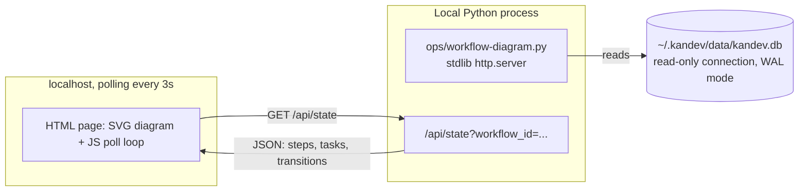

# Feature: Live Workflow Diagram

## Why

Right now the only way to see how tasks actually move through a Kandev workflow — which
steps get returned to, how often, by which route — is to read the YAML prompts (the
*possible* routes, as text) or query `task_step_transitions` by hand (the *actual* routes,
as rows). Neither gives a picture. This session alone needed several ad-hoc SQL queries
against `task_step_transitions` just to reconstruct what had happened to two stuck tasks —
work a diagram would make instant.

**Who benefits.** Sharif, watching multiple tasks move through `Design Doc` / `Feature
Delivery` day to day — spotting a task stuck in a reject loop, or a step that returns tasks
unusually often, at a glance instead of by query. Secondarily: Kandev itself doesn't ship
this feature (verified below), so a working local prototype is also a concrete artifact for
a potential upstream contribution to `github.com/kdlbs/kandev`.

**Motivating scenario.** A task cycles Draft → Review → Draft → Review → Draft three times
before finally passing (this happened to the UI/UX design-doc task and to Ticket 5 this
session). Today, seeing that shape requires deliberately querying
`task_step_transitions` and reading timestamps. With this feature, it's visible as three
backward arcs on one screen, updating live as the fourth round plays out.

## Scope

**In scope:**
- A local tool (`ops/workflow-diagram.py`) — no published Artifact, no external hosting.
  Reads `~/.kandev/data/kandev.db` directly (read-only), serves a single HTML page over
  `localhost`.
- One workflow diagrammed at a time, selectable (Design Doc / Feature Delivery / any other
  workflow in the workspace).
- Block-and-line layout: one node per workflow step, positioned left-to-right by the step's
  `position` field.
- Edges derived empirically from `task_step_transitions` history for that workflow — not
  hand-authored, not parsed from prompt text.
- Live overlay: every currently active (`archived_at IS NULL` — this includes tasks sitting
  at a human gate like Needs Human/Human Approval, which is exactly what you want visible,
  not filtered out) task shown as a labeled marker on its current step's node, auto-refreshing
  on a poll interval.
- Per-task trails: click a task's marker to trace its full transition history as an ordered
  path over the diagram; backward/reject moves visually distinct from forward moves.

**Explicitly out of scope:**
- Editing anything — this is read-only observability, never a way to move a task or edit a
  workflow.
- A real-time push mechanism (WebSocket, SSE) — polling is sufficient for a human watching a
  screen; not worth the complexity for v1.
- Multi-workflow overview (all workflows on one screen) — pick one workflow, see it well.
- Porting this into Kandev's actual Go/frontend source, or opening the upstream
  contribution — this doc's scope ends at a working local prototype. Whether/how to
  upstream it is a separate decision after the prototype proves useful.
- Any change to `workflows/*.yaml` or the live Kandev instance's step configuration.

## Design

### Data layer

Three tables in `~/.kandev/data/kandev.db` (confirmed via schema inspection this session,
`journal_mode = wal` confirmed — safe for a read-only connection to poll alongside Kandev's
own writer with no lock contention):

- `workflow_steps` (`id, workflow_id, name, position, color, is_start_step, ...`) — the
  diagram's nodes. One query at startup (and on workflow switch); steps rarely change
  mid-session, no need to re-poll this table every tick.
- `tasks` (`id, workflow_id, workflow_step_id, title, state, archived_at, ...`) — which
  tasks are currently on which node. Filtered to `archived_at IS NULL` for "active."
  Re-queried every poll.
- `task_step_transitions` (`id, task_id, from_workflow_step_id, to_workflow_step_id,
  trigger, actor_kind, occurred_at, ...`) — every transition that has ever actually
  happened, for every task, in that workflow. This is both the edge source (the *set* of
  distinct `from_step, to_step` pairs seen) and the trail source (one task's own rows, in
  `occurred_at` order). Re-queried every poll (cheap — indexed by `task_id`, small table
  even after weeks of use).

All connections opened `sqlite3.connect(f"file:{db_path}?mode=ro", uri=True)` — read-only
at the connection level, not just by convention, so a bug in this tool can't corrupt
Kandev's own database.

### Layout

Steps are laid out left-to-right by their `position` integer (already how Kandev itself
orders them — Backlog=0, Draft=1, ... Done/Needs Human last). Each step is a rectangle,
colored with its own `color` field (reusing Kandev's own step colors, so the diagram reads
consistently with the Kanban board Sharif already knows).

Edges are drawn as SVG paths:
- **Forward** (`to.position > from.position`, the common case): a straight or gently
  curved line above the main row, arrowhead at the target.
- **Backward** (`to.position <= from.position`, a reject/rework/redo): a curved arc drawn
  *below* the main row, visually distinct (dashed stroke, a different color — e.g. the
  product's own "critical" accent, reused for consistency with anything else Sharif's
  projects use it for) so a reject loop is unmistakable from a normal forward flow at a
  glance.

No general-purpose graph-layout library (dagre, elkjs) is needed — the x-position is
already fully determined by `position`, and step counts are small (7–11 per workflow), so
y-jitter to avoid edge overlap can be computed directly (stack same-direction edges that
share a span at increasing arc heights).

### Live task overlay

Each active task is a small labeled marker (task title, truncated) positioned at its
current step's node. On each poll tick (default 3s, configurable), markers are
re-positioned/added/removed to match the current `tasks` query — no animation required for
v1 (a marker just appears at its new position on the next tick), though a short CSS
transition on position change is cheap to add and worth doing since "flow" is the point.

### Per-task trails

Clicking a task's marker highlights that task's full `task_step_transitions` history as an
ordered, arrowed path drawn on top of the base diagram (dimming the rest). Reuses the same
forward/backward line styling as the base edges. Clicking elsewhere (or the task again)
clears the highlight.

### Architecture



Single Python file, stdlib only (`http.server`, `sqlite3`, `json`) — no `pip install`, no
new dependency for this repo's `ops/` tooling. The HTML/JS/CSS is embedded as a string
constant in the same file (matching the "one file, no build step" spirit of the other
`ops/*.py` tools) and rendered as plain SVG + vanilla JS — no CDN, no framework, works
fully offline.

`/api/state?workflow_id=<id>` returns:
```json
{
  "steps": [{"id": "...", "name": "Draft", "position": 1, "color": "bg-purple-500"}, ...],
  "tasks": [{"id": "...", "title": "Ticket 5 - ...", "workflow_step_id": "..."}, ...],
  "edges": [{"from": "<step_id>", "to": "<step_id>", "count": 3}, ...],
  "trails": {"<task_id>": [{"from": "...", "to": "...", "occurred_at": "..."}, ...]}
}
```
`edges` is pre-aggregated server-side (`GROUP BY from_step, to_step, COUNT(*)`) so the
frontend never has to compute it from raw transitions — `count` is available for a
tooltip/label even though v1's primary visualization is per-task trails, not aggregate
weights (that was the alternative approach considered and not chosen, per the brainstorm —
keeping the count in the payload costs nothing and leaves room for it later without a data
model change).

### Usage

```
./ops/workflow-diagram.py [--port 8420] [--poll-interval 3]
```
Opens (or prints a URL for) `http://localhost:8420/`, a workflow picker (populated from the
`workflows` table), then the diagram for the selected workflow.

## Behaviour

1. Given a workflow with N steps, when the diagram loads, then all N steps render as nodes
   positioned left-to-right by `position`, colored per their `color` field.
2. Given a workflow with zero task history, when the diagram loads, then nodes render with
   no edges — an empty-history state is not an error.
3. Given a task currently on step X, when the diagram polls, then a marker for that task
   appears on X's node within one poll interval.
4. Given a task moves from step X to step Y between polls, when the next poll runs, then the
   task's marker moves from X to Y and a new edge (or an updated count on an existing edge)
   reflects that transition.
5. Given `to.position <= from.position` for any transition, when its edge is drawn (base or
   trail), then it renders with the backward visual style (dashed, distinct color, arc below
   the row) — never styled the same as a forward edge.
6. Given a task with M recorded transitions, when its marker is clicked, then all M
   transitions render as one ordered, arrowed path in `occurred_at` order, and clicking again
   (or elsewhere) clears the highlight.
7. Given Kandev's backend is actively writing to `kandev.db` while the diagram polls, then no
   read ever blocks on or is blocked by that write (WAL mode, read-only connection) and no
   read ever raises a "database is locked" error.
8. Given the tool is asked to open a workflow_id that doesn't exist, then it returns a clear
   error in the API response and the frontend shows a message — not a stack trace or a blank
   page.

## Risks & second-order effects

- **This reads Kandev's internal SQLite schema directly, which is not a public/versioned
  API.** A future Kandev version could rename or restructure these tables and silently break
  this tool with no warning. *Mitigation:* the tool should fail loudly (a clear "schema
  mismatch" message, not a silent empty diagram) if an expected column is missing — cheap to
  add, worth doing given this dependency is inherently fragile. This is also the strongest
  argument, if the prototype proves useful, for eventually building the real version against
  Kandev's own (presumably more stable) internal Go APIs rather than raw SQL — explicitly
  deferred, per Scope, to a future decision.
- **Read-only DB access is a real safety property, not just a convention** — worth keeping
  as a hard invariant if this code is ever extended, since accidentally becoming a write path
  would put Kandev's own task state at risk from a tool that was supposed to be purely
  observational.
- **Polling every 3s against a growing `task_step_transitions` table** — fine at current
  scale (a handful of tasks, low hundreds of transitions), but the `edges` aggregation query
  is a full-table `GROUP BY` with no index hint considered yet. *Mitigation:* not a v1
  concern; note it as a revisit trigger if the table grows past ~10k rows and polling starts
  measurably lagging.
- **Backward-edge definition (`to.position <= from.position`) is a heuristic, not a semantic
  truth.** It correctly identifies reject-to-Draft moves (the common case) but would also
  flag a same-position move (e.g. a lateral move Kandev doesn't currently do) as "backward."
  *Mitigation:* acceptable for v1 given no current workflow has same-position transitions;
  revisit if that changes.

## Success criteria

1. Running `./ops/workflow-diagram.py` against the live local Kandev instance shows a
   correct, live-updating diagram of `Feature Delivery` reflecting Ticket 5's actual
   in-progress reject loop (Draft → Review-Spec → Draft, observed this session) as backward
   edges.
2. A front-end engineer (or Sharif) can look at the diagram for 10 seconds and correctly
   state which step currently has the most active tasks and which edge has been traversed
   most, without running any SQL.
3. No `pip install` or CDN fetch is required to run it — `python3 ops/workflow-diagram.py`
   works standalone on a machine with only the stdlib.
4. It survives Kandev actively writing to the DB during a poll (tested by watching it run
   while a live task moves) with no lock errors and no stale/incorrect data past one poll
   interval.
