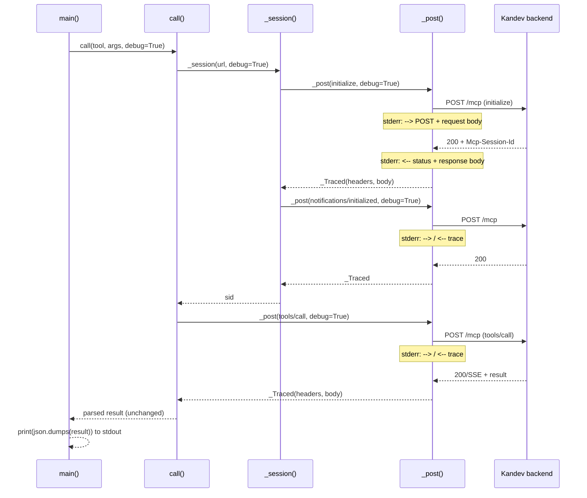

# Feature: `--debug` flag for `ops/kandev-mcp.py`

## Why

`ops/kandev-mcp.py` is the shell-level client used to poke the running Kandev MCP server (`./ops/kandev-mcp.py <tool> '<json-args>'`). When a call fails or returns something unexpected, there is currently no way to see what actually went over the wire — the script parses `tools/call` responses (bare JSON or SSE) and returns only the unwrapped result, silently swallowing the handshake (`initialize` / `notifications/initialized`) traffic and the raw envelope around the result.

Whoever benefits: the person debugging a stuck task, a malformed `tools/call` payload, an unexpected 4xx/5xx from the backend, or an SSE-vs-bare-JSON parsing mismatch (`ops-troubleshooting`, `resume-driver.py` failures, workflow-step sync issues per CLAUDE.md's "verify with a semantic diff" step). Today the only recourse is to hand-edit the script to add prints, then remove them again.

Motivating scenario: `update_workflow_step_kandev` call returns `{"_raw": ...}` because the response didn't parse as JSON or SSE — with `--debug` the user sees the literal bytes the server sent instead of guessing why parsing fell through.

## Scope

In scope:

- A `--debug` / `-d` boolean flag on the `argparse` parser in `main()`.
- Threading a `debug: bool = False` parameter through `call()` → `_session()` → `_post()`, so the flag also works for anyone importing `call()` as a library function (the module docstring documents it as importable).
- In `_post()`, when `debug` is true: print the outgoing method + URL + pretty-printed JSON request body to stderr immediately before `urlopen()`, then print the response status + raw response body to stderr immediately after reading it, before `_post()` returns.
- Tracing covers all three HTTP round trips made per `call()` invocation: `initialize`, `notifications/initialized`, `tools/call`.
- Tracing an HTTP error response too (`urllib.error.HTTPError` bodies are read and printed before the exception re-raises), since error bodies are usually the most useful case for `--debug`.
- Updating the script's own module docstring/usage block to mention `--debug`.

Explicitly out of scope:

- Truncating, redacting, or size-capping printed bodies (the whole point is the raw bytes; local dev tool against localhost, no secrets in these payloads today).
- A general logging framework, log levels, or a `--verbose` gradient — this is a single on/off trace switch.
- Persisting trace output to a file (stderr only; redirect with `2>` if needed).
- Changing return values, parsing logic, or any non-debug-path behavior.
- Editing `CLAUDE.md` or other docs beyond the script's own header comment.
- Tracing connection-level failures (`urllib.error.URLError`, timeouts, refused connections) — these have no response body to show, so `--debug` adds nothing over the existing bare traceback for that class of failure.

## Design

### Approaches considered

1. **Module-level global flag** (`_DEBUG = False`, set from `main()`, read inside `_post()`). Simplest edit — no signature changes ripple through `_session` / `call`. Rejected: mutable global state means `call()` can no longer be used as a clean library function with per-call debug control (the docstring explicitly documents `call()` as importable); hidden dependency makes the function's behavior depend on module state instead of its arguments.

2. **Thread `debug: bool` explicitly through `call()` → `_session()` → `_post()`** (recommended). Every function's behavior stays a pure function of its arguments; a caller importing `call()` can pass `debug=True` per-call without touching global state. Trade-off: this is a boolean parameter threaded through three functions, which `clean-code` flags as a smell when a flag makes a function branch into two responsibilities. Here the branch is a genuinely orthogonal, cross-cutting concern (observability) rather than the function doing two different jobs — `_post()` still does exactly one thing (POST and return a response); tracing is a side-channel wrapped around the one thing. Given the script is 88 lines with three call sites, a bigger abstraction (context manager, injected logger) would be over-engineering for the scope.

3. **`http.client.HTTPConnection.debuglevel = 1`** (stdlib's built-in low-level HTTP tracing, since `urllib.request` sits on `http.client`). Rejected: prints to stdout, not stderr (would corrupt the script's stdout contract, which is the pretty-printed JSON result meant to be piped/parsed); format is raw socket-level dump mixed with chunked-encoding noise, not a clean request/response body view; not controllable per-call.

Recommendation: approach 2.

### Data / state model

No persistent state. `debug` is a plain `bool` passed by value through the call chain; nothing is stored between invocations.

One small addition: because `_post()`'s debug path must read the full response body to print it (consuming the file-like object `urlopen()` returns), it needs to hand callers something that still satisfies the `.headers` / `.read()` shape that `_session()` and `call()` already rely on. A minimal wrapper is used:

```python
class _Traced:
    def __init__(self, headers, body):
        self.headers = headers
        self._body = body
    def read(self):
        return self._body
```

`_post()` returns this instead of the raw `urlopen()` response only when `debug=True`; the non-debug path is untouched (still returns the live response object, still streams as before). `body` is stored as `bytes` (matching `HTTPResponse.read()`'s return type), so downstream `.read().decode()` call sites behave identically whether debug is on or off.

### Key components

- `main()` — owns the `--debug` CLI flag; passes `ns.debug` into `call()`. No other responsibility change.
- `call(tool, args, url=DEFAULT_URL, debug=False)` — passes `debug` to `_session()` and to its own `tools/call` `_post()` invocation. Parsing/return logic unchanged.
- `_session(url, debug=False)` — passes `debug` to both of its `_post()` calls (`initialize`, `notifications/initialized`).
- `_post(url, body, sid=None, timeout=180, debug=False)` — the only function that actually prints. Owns: printing the request line + body before `urlopen()`; printing the response status + body (and wrapping the result in `_Traced`) after reading, before returning; and, on `urllib.error.HTTPError`, printing the error body before re-raising so failures are traceable too.

### Sequence (one `call()` invocation, `--debug` on)



## Behaviour

- Running without `--debug` produces byte-identical stdout and no stderr output compared to the current script (regression check, not new behavior).
- Running with `--debug` prints, to stderr only, for each of the three HTTP round trips in one invocation: the request method, URL, and pretty-printed JSON body, followed by the response status code and raw response body — each pair printed before that `_post()` call returns control to its caller.
- `--debug` never writes to stdout; the final `json.dumps(call(...), indent=2)` printed by `main()` is identical to the non-debug run, so stdout stays pipeable/parseable.
- `--debug` does not change the parsed return value of `call()` — the caller of `call()` (whether `main()` or an importer) gets the same dict either way.
- If the backend returns a non-2xx status, `--debug` prints the error response body to stderr before the `urllib.error.HTTPError` propagates (today it just propagates with no body visible).
- `call()` remains usable as a library function with `debug=True` passed per-call, without mutating any module state.
- Connection-level failures (`URLError`, timeouts) are unaffected by `--debug` — no response exists to trace, so behavior (a bare traceback) is unchanged from today.

## Risks & second-order effects

- Large tool results (e.g. a long `get_task_conversation_kandev` transcript) printed in full to stderr could flood a terminal. Accepted trade-off — this is an opt-in local debugging flag and the ask is explicitly "print the raw ... bodies", not a summarized/truncated view. No truncation is implemented per the "explicitly out of scope" list above; if this becomes a real pain point later, a `--debug` size cap can be a follow-up, not part of this change.
- The debug path fully buffers the response into memory via `resp.read()` before returning it (`_Traced` holds the whole body as bytes). For the small JSON-RPC payloads this client handles, that's negligible; the non-debug path is unaffected and keeps streaming semantics.
- No secrets currently flow through these requests (localhost-only MCP session, no auth headers), so printing full headers/bodies has no credential-leak risk today. If auth is ever added to this client, `--debug` would need a redaction pass — noted here so it isn't missed, but not implemented now (out of scope).
- Downstream callers of `_post()`'s return value (`_session()` reading `r.headers.get("Mcp-Session-Id")`, `call()` calling `.read()`) must keep working against `_Traced` exactly as they do against the real response object — this is why `_Traced` mirrors only the two members actually used (`headers`, `read()`) rather than trying to fully proxy `http.client.HTTPResponse`.

## Success criteria

- `./ops/kandev-mcp.py --debug list_workspaces_kandev '{}'` shows readable request/response JSON for all three round trips on stderr, and the same parsed JSON result on stdout as running without `--debug`.
- `./ops/kandev-mcp.py list_workspaces_kandev '{}'` (no flag) is unchanged: identical stdout, no stderr output, no behavior difference from before this change.
- Forcing a backend error (e.g. a bad `workflow_id`) with `--debug` shows the error response body on stderr instead of a bare traceback with no body.
- `node --test` / existing toy test suite is unaffected (this file isn't touched by it) — no regressions there.
