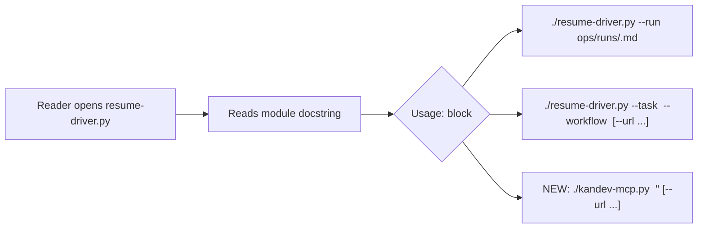

# Feature: resume-driver.py usage comment

## Why

`ops/resume-driver.py` is the operational tool that un-sticks a Kandev task after
a Claude session-limit death (per `CLAUDE.md`'s "Resume a stuck task" command and
`docs/kandev-brief.md`'s resume mechanics). Its companion, `ops/kandev-mcp.py`, is
invoked directly from `CLAUDE.md`'s Commands section with a documented one-liner:

```
./ops/kandev-mcp.py <tool> '<json-args>' [--url http://localhost:38429]
```

`resume-driver.py` has no equivalent inline hint pointing back to
`kandev-mcp.py`. Someone opening the file cold (skimming `ops/` without
`CLAUDE.md` open) sees the driver's own `--run` / `--task` usage in its
docstring, but nothing connecting it to the lower-level MCP CLI it wraps calls
through. This is a pure discoverability nit surfaced as a workflow smoke test —
the ask is exactly one line, added once, at the top of the file.

Who benefits: anyone reading `ops/resume-driver.py` directly (not via
`CLAUDE.md`) who wants to know how to drive the underlying MCP tool it's
built on.

## Scope

In scope:
- Add one line near the top of `ops/resume-driver.py` — inside the existing
  module docstring (which already contains a `Usage:` block, see lines 1-19)
  — showing the `kandev-mcp.py <tool> <json>` invocation form, so a reader of
  this file alone has the pointer.

Explicitly out of scope:
- Any change to `ops/kandev-mcp.py` itself.
- Any change to `resume-driver.py`'s actual behavior, arguments, or logic.
- Rewriting or restructuring the existing docstring beyond inserting the one
  line.
- Updating `CLAUDE.md` or `docs/kandev-brief.md` (they already document this).

## Design

### Approaches considered

1. **Insert one line inside the existing `Usage:` block in the module
   docstring** (recommended). Gives up: nothing meaningful — it's additive to
   a block that already exists for exactly this purpose.
2. **Add a standalone `# kandev-mcp.py <tool> <json>` comment line above the
   shebang/docstring**, as literally suggested by the task title. Gives up:
   consistency — the file already has a `Usage:` section in its docstring;
   a bare `#` comment above the shebang would be an odd, disconnected second
   place to look for usage info, and tools like `pydoc`/`--help` conventions
   expect usage text inside the docstring, not before it.
3. **Do nothing / rely on `CLAUDE.md`**. Gives up: the discoverability this
   task exists to fix — CLAUDE.md is exactly what a reader of just this file
   won't have open.

Recommendation: **Approach 1**. It reuses the file's existing documentation
convention instead of inventing a second one, keeps the change to one line,
and puts the hint where a reader's eye already goes (the `Usage:` block).

### Data / state model

None — this is a comment-only change to a script's docstring. No runtime
behavior, data structures, or state are affected.

### Components

Single component: `ops/resume-driver.py`'s module docstring. No other files
change.



## Behaviour

- Opening `ops/resume-driver.py` and reading its module docstring shows a
  line demonstrating `kandev-mcp.py <tool> <json>` usage, alongside the
  existing `--run` / `--task` usage lines.
- `resume-driver.py --help` (argparse) output is unchanged — the new line
  lives in the module docstring's `Usage:` prose block, not in an argparse
  `description=`/`epilog=` string, so no CLI behavior changes. (If the
  docstring is in fact wired into argparse's `description`, the implementer
  should confirm the added line still reads correctly in `--help` output;
  either placement satisfies this design, but the file must stay internally
  consistent.)
- No test, CLI flag, exit code, or log line changes.
- `git diff` for this change touches exactly one file, adding one line.

## Risks & second-order effects

- Near-zero risk: comment-only edit, no behavior change, single file.
- Second-order effect worth naming: this creates a second place
  (`CLAUDE.md` and now `resume-driver.py`'s own docstring) that documents the
  `kandev-mcp.py` invocation form. If that form's flags ever change, both
  need updating — but `CLAUDE.md` already asserts it must stay in sync with
  reality, so this doesn't introduce a new sync burden, just a second echo of
  one that already exists.
- No effect on the live Kandev instance, workflows, or other scripts —
  `ops/resume-driver.py` is not imported by anything else in this repo.

## Success criteria

- `ops/resume-driver.py`'s module docstring contains a line showing the
  `kandev-mcp.py <tool> <json>` usage form.
- No other line in the file changes.
- `python3 -c "import ast; ast.parse(open('ops/resume-driver.py').read())"`
  (or equivalent) still parses — i.e. the docstring is still valid Python.
