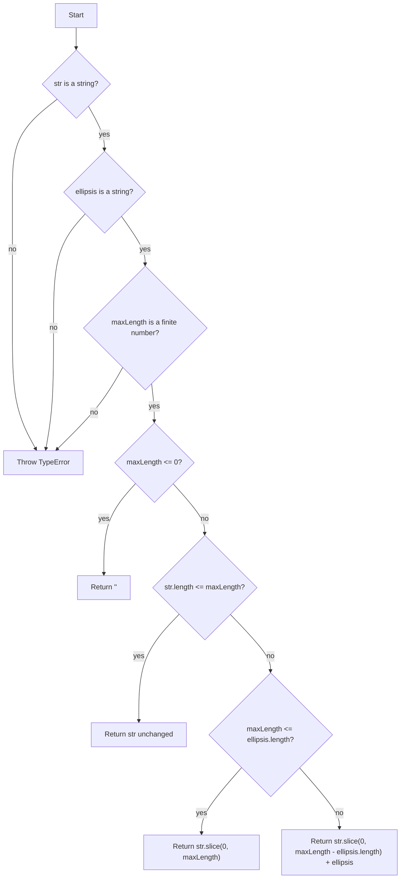

# Feature: `truncate(str, maxLength, ellipsis = '...')`

## Why

`src/strings.js` currently exposes `reverse` and `capitalize` — small, pure, dependency-free string helpers. Consumers regularly need to shorten a string for display (table cells, notification text, log lines, card previews) while signalling that content was cut. Today every caller would hand-roll `str.slice(0, n) + '...'`, which is easy to get subtly wrong (off-by-one on the ellipsis, no handling of short/zero lengths, inconsistent ellipsis characters across call sites). A single shared `truncate` closes that gap and keeps the module's existing minimal, allocation-free style.

## Scope

In scope:

- `truncate(str, maxLength, ellipsis = '...')` added to `src/strings.js` and the module's `module.exports`.
- Character-based (code-unit) length semantics, matching `reverse` and `capitalize`, which are also naive on code units (no grapheme/surrogate pair awareness).
- Defined behavior for `maxLength` of 0, negative, non-finite (`NaN`, `Infinity`), and smaller than the ellipsis length.
- A configurable ellipsis string, defaulting to `'...'`, validated the same way as `str`.
- Input validation consistent with the rest of the module, applied uniformly to all three parameters (`str`, `maxLength`, `ellipsis`) rather than only some of them.

Explicitly out of scope:

- Word-boundary-aware ("smart") truncation — cutting at the nearest space so words aren't split mid-word. This is a real, common want, but it adds a scan loop, an ambiguous contract for strings with no whitespace, and at least one more option (e.g. whether to trim trailing whitespace before appending the ellipsis). None of the module's existing helpers take an options object; adding one here for a single flag would break that consistency for a feature nobody has asked for yet.
- Unicode-aware truncation (grapheme clusters, combining marks, emoji ZWJ sequences). `reverse` already has this same limitation (it corrupts surrogate pairs), so `truncate` matching that limitation is consistent, not a regression.
- Truncating from the middle or the start of the string (e.g. `"abc...xyz"`); only end-truncation is requested.
- HTML/markup-aware truncation.

## Design

### Approaches considered

**A.** `maxLength` **counts the final output length (ellipsis included).**`truncate('hello world', 5)` → `'he...'` (5 chars total: 2 kept + 3-char ellipsis). This is the contract used by lodash's `_.truncate` and Python's common truncate-with-suffix idiom. Give up: for small `maxLength` the amount of *original content* shown is `maxLength - ellipsis.length`, which can be zero or negative — needs an explicit fallback rule (see below). Gain: callers can reason about a hard output-width budget (e.g. "never exceed 80 chars on screen"), which is the actual reason most callers reach for a truncate helper (fitting a fixed-width UI slot).

**B.** `maxLength` **counts only the kept content; the ellipsis is added on top.** `truncate('hello world', 5)` → `'hello...'` (8 chars total). Give up: the output can exceed `maxLength`, which is surprising given the function's name and defeats the "fit this into N characters" use case. Gain: simpler internal logic (no interaction between `maxLength` and `ellipsis.length`), and the kept substring is always exactly `maxLength`characters when truncation occurs.

**C. Options-object signature (**`truncate(str, { maxLength, ellipsis, wordBoundary })`**).** Gain: room to grow (word-boundary flag, position of cut) without a breaking signature change later. Give up: inconsistent with `reverse(str)` / `capitalize(str)`'s plain-positional style in this file, and adds ceremony for a helper whose primary use case (A or B above) needs only two values.

**Recommendation: A**, with a plain `(str, maxLength, ellipsis)` signature (not C). "Truncate to N" reads most naturally as "the result is at most N characters," matching the dominant precedent (lodash) and the likeliest caller intent (fitting a display budget). The options-object flexibility in C is speculative generality per the module's own precedent — `reverse` and `capitalize` took the same "add a param when a real need shows up" approach and it has cost nothing so far.

### Fallback rule for small `maxLength`

When `maxLength <= ellipsis.length`, there is no room to show any original content alongside the ellipsis. Two sub-options:

- Return `ellipsis.slice(0, maxLength)` (lodash's behavior) — e.g. `truncate('hello', 2, '...')` → `'..'`. Confusing: the output no longer contains any of the original string, and a caller skimming the result might mistake a truncated ellipsis for real content.
- Fall back to a hard, ellipsis-free slice: `str.slice(0, maxLength)` — e.g. `truncate('hello', 2)` → `'he'`. **Chosen.** Simpler to state, always returns a prefix of the real string (never fabricated characters), and the "no truncation marker fits" case is rare enough in practice (`maxLength < 3` with the default ellipsis) that a slightly less polished result is an acceptable trade for a rule with no edge cases of its own.

### Input validation rule

All three parameters get an explicit guard before any of the decision-tree logic runs, **in this fixed order: `str`, `ellipsis`, `maxLength`** (matching the flowchart below; when more than one argument is simultaneously invalid, the `str` check fires first, then `ellipsis`, then `maxLength` — no test in this doc depends on this order, but implementations must pick one, and this is it). The guiding principle, made uniform across all three params: **any input whose bad type or value would otherwise reach the arithmetic silently (via** `NaN` **or** `undefined` **propagating through** `-`**,** `.length`**, or** `slice`**) must be rejected with a thrown** `TypeError`**instead of being allowed to produce a quietly wrong result.**

- `str`: guard `typeof str !== 'string'` → throw `TypeError`.
- `ellipsis`: guard `typeof ellipsis !== 'string'` → throw `TypeError`. This closes the same class of gap as the `maxLength` guard below: a non-string `ellipsis` (e.g. a number) has an `undefined` `.length`, which turns `maxLength - ellipsis.length` into `NaN` and silently produces `'' + ellipsis` (a stringified copy of the bad argument, not truncated original content) instead of throwing. There is no principled reason to validate `str` and `maxLength` but exempt `ellipsis` — it participates in the same arithmetic and has the same failure mode.
- `maxLength`: guard `typeof maxLength !== 'number' || !Number.isFinite(maxLength)`→ throw `TypeError`. Using `Number.isFinite` (not a bare `typeof`check) is required because `typeof NaN === 'number'` — a `typeof`-only guard silently admits `NaN`, which then propagates through `maxLength - ellipsis.length` and produces a wrong (not thrown) result. Rejecting `NaN` and `±Infinity` here is a single call, no extra branch. Non-integer finite values (e.g. `5.5`) are accepted — `str.slice` truncates fractional indices toward zero, so `truncate('hello world', 5.5)` behaves identically to `maxLength: 5`. This is intentional: it is standard `slice` semantics, not a new failure mode, and does not warrant a dedicated guard.

All three guards run before the `maxLength <= 0` check, so an invalid value never reaches decision-tree logic regardless of what `maxLength`'s sign or magnitude would otherwise trigger.

### Data / state model

None — this is a pure, stateless function, consistent with `reverse` and `capitalize`. No new module state, no dependencies.

### Behavior summary (see full statements below)

## Behaviour

 1. `truncate('hello world', 20)` → `'hello world'` — string no longer than `maxLength` is returned unchanged (no ellipsis appended even though the default ellipsis exists).
 2. `truncate('hello world', 8)` → `'hello...'` — result length equals `maxLength` exactly (5 kept chars + 3-char ellipsis = 8).
 3. `truncate('hello world', 11)` → `'hello world'` — boundary: `str.length === maxLength` is "no truncation needed," not "truncate to empty room."
 4. `truncate('hello', 0)` → `''`.
 5. `truncate('hello', -3)` → `''` — negative `maxLength` is clamped to 0, not treated as an error (mirrors how `str.slice` tolerates out-of-range indices rather than throwing).
 6. `truncate('hello', 2)` → `'he'` — `maxLength` smaller than the ellipsis length falls back to a hard slice with no ellipsis appended.
 7. `truncate('hello', 3)` → `'hel'` — `maxLength === ellipsis.length`still falls back to a hard slice (there is zero room left for kept content once the ellipsis is subtracted, so an ellipsis-only result would show nothing original).
 8. `truncate('hello world', 8, '…')` → `'hello w…'` — custom single character ellipsis is honored and counted like any other ellipsis string.
 9. `truncate('hello world', 2, '…')` → `'he'` — the fallback rule in (6) applies per-call based on the actual `ellipsis` argument, not a hardcoded `3`.
10. `truncate(123, 5)` and `truncate(null, 5)` → throw `TypeError` — same class of guard the module should apply consistently; `capitalize`already implicitly assumes a string (`.charAt` on a number throws `TypeError: str.charAt is not a function`), so `truncate` throwing explicitly is at least as strict, not a new burden on callers.
11. `truncate('hello', 'abc')` → throw `TypeError` — non-numeric `maxLength` is rejected rather than silently coerced (`'abc' <= 0` is `false` in JS, `str.length <= 'abc'` is `false`, so without a guard this would silently fall through to slicing with `NaN` math and produce a wrong, non-empty result instead of a loud error).
12. `truncate('', 5)` → `''`.
13. `truncate('hello', NaN)` and `truncate('hello', Infinity)` → `truncate(..., NaN)` throws `TypeError` (fails the `Number.isFinite` check — a bare `typeof` guard would have missed this since `typeof NaN === 'number'`); `truncate(..., Infinity)`also throws `TypeError` for the same reason (`Infinity` is not finite), even though naively it "would have worked" via `str.length <= Infinity` — rejecting it keeps the finite-number contract simple and exception-free rather than special-casing one non-finite value as acceptable and another as not.
14. `truncate('hello world', 8, 5)` → throw `TypeError` — a non-string `ellipsis` is rejected before it can reach `ellipsis.length`(`undefined` for a number) and turn `maxLength - ellipsis.length`into `NaN`, which would otherwise silently return `'5'` (the stringified bad argument) instead of truncated content.

## Risks & second-order effects

- **Silent truncation in logs/UI.** Because `truncate` never throws or warns when it cuts content, any caller that swaps a raw string for `truncate(str, n)` could silently drop information a user or operator needed (e.g. a truncated error message hiding the actual cause). This is inherent to the feature, not a defect — flagging it so call sites are reviewed for whether "cut and mark with ellipsis" vs. "log full, display truncated" is the right choice, not blanket-applied.
- **Ellipsis counted in** `maxLength` **surprises callers expecting behavior B**.A developer coming from a codebase where "truncate to 10" means "10 kept characters plus ellipsis" will get a different (shorter) result here. Mitigated by documenting the contract in a short comment above the function and behavior test (1)-(3) above being explicit about it.
- **No word-boundary support may push callers to re-roll their own helper**for prose-heavy UI text (e.g. truncating a paragraph preview), defeating the goal of a single shared helper. Acceptable for v1 since no caller has requested it yet; noted in Scope as the most likely follow-up extension if/when a concrete need appears.
- **Three independent guard branches, plus the** `maxLength <= 0` **check**,are the only added control flow in a module that's otherwise pure one-liners — still small enough not to warrant splitting into a helper, but the largest departure yet from the module's zero-guard-clause style (`reverse`/`capitalize` throw only implicitly, via method calls on the wrong type). This is a deliberate, documented precedent: any future helper added to this module that takes multiple positional arguments participating in shared arithmetic should validate all of them uniformly, not just the ones that are easy to get wrong.

## Success criteria

- `truncate` is exported from `src/strings.js` alongside `reverse` and `capitalize`.
- All 14 behaviour statements above pass as unit tests.
- No new dependencies, no options object, no change to `reverse` or `capitalize`.
